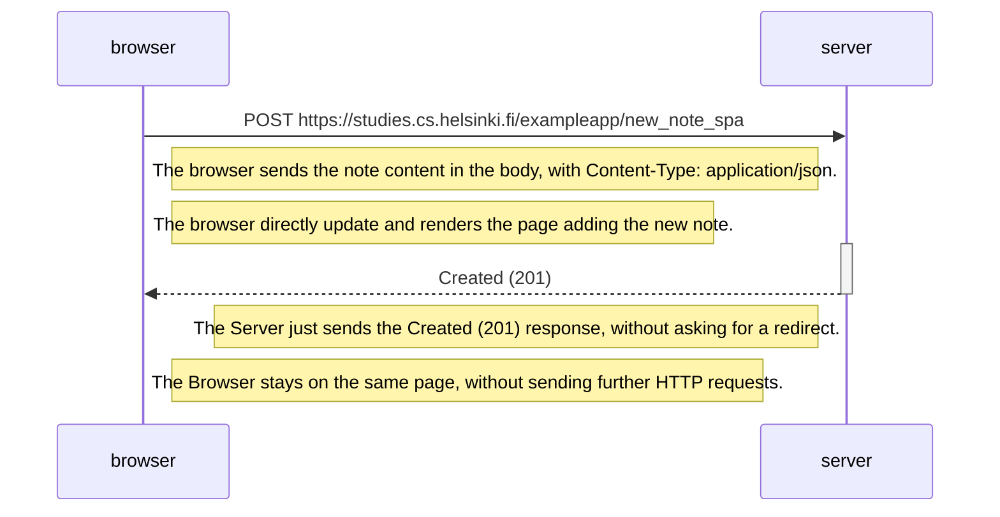

# Diagram

```mermaid
sequenceDiagram
  participant browser
  participant server  

    browser->>server: POST https://studies.cs.helsinki.fi/exampleapp/new_note_spa

    Note right of browser: The browser sends the note content in the body, with Content-Type: application/json.

    Note right of browser: The browser directly update and renders the page adding the new note.

    activate server
    server-->>browser: Created (201)
    deactivate server

    Note left of server: The Server just sends the Created (201) response, without asking for a redirect.

    Note right of browser: The Browser stays on the same page, without sending further HTTP requests.
```
